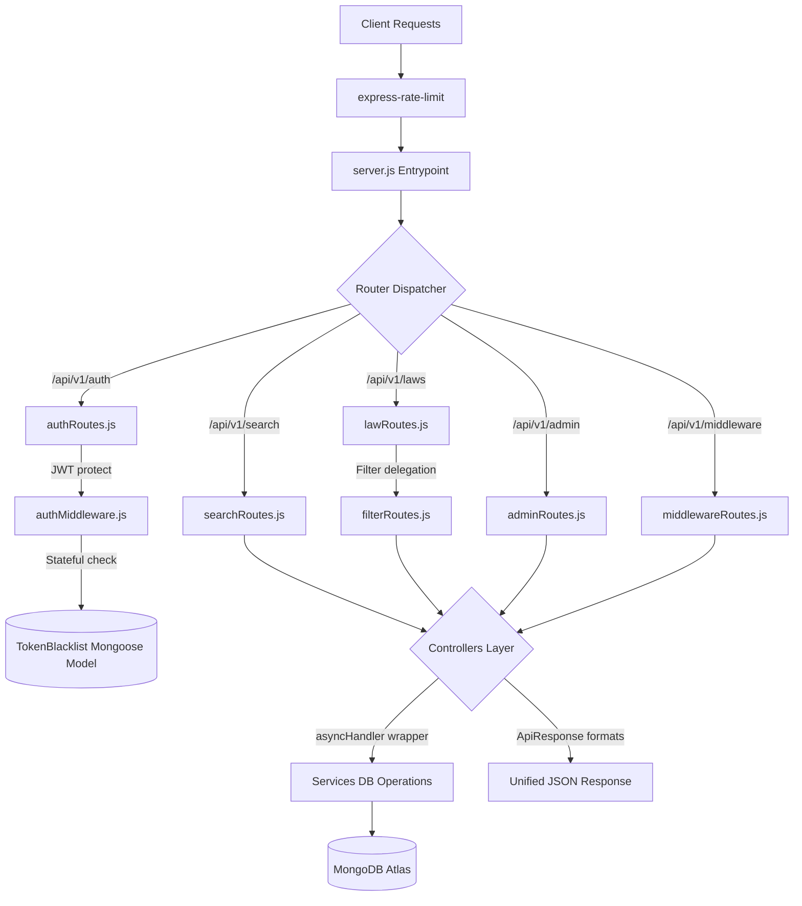

<div align="center">

# 🏛️ Indian Law Penal Code Dashboard

### Full Stack MERN Project — Admin & User Dashboard System

[](<!-- LIVE_FRONTEND_URL -->)
[](<!-- LIVE_BACKEND_URL -->)
[](https://documenter.getpostman.com/view/50839172/2sBXwmRDfh)
[](<!-- GITHUB_REPO_URL -->)

---

**Student:** Dhruv Ozha &nbsp;|&nbsp; **University:** CodingGita × Swaminarayan University &nbsp;|&nbsp; **Semester:** 2 &nbsp;|&nbsp; **Marks:** 80  
**Batch:** 2025–2029 &nbsp;|&nbsp; **Duration:** 13 May – 13 June 2026 &nbsp;|&nbsp; **Stack:** MERN

</div>

---

## 📸 Project Screenshots

> *(Update the image links below after deployment)*

### 🔐 Login Page
<!-- Add screenshot: replace the src below -->


### 🏠 Dashboard Home


### ⚖️ Laws Listing Page


### 🔍 Search & Filter


### 📊 Analytics Dashboard


### ⚖️ Admin — User Management


### 📋 Law Detail Page


### 🌙 Dark Mode


---

## 🌐 Live Links

| Resource | URL |
|---|---|
| 🌐 Frontend (Live) | <!-- LIVE_FRONTEND_URL --> |
| 🔗 Backend API (Live) | <!-- LIVE_BACKEND_URL --> |
| 📮 Postman Collection | https://documenter.getpostman.com/view/50839172/2sBXwmRDfh |
| 💾 GitHub Repository | <!-- GITHUB_REPO_URL --> |
| 📁 Dataset (Google Drive) | https://drive.google.com/drive/folders/1O4tgEesnymnLO06_qrCacGBDxSBkJeSH |

---

## 📋 Table of Contents

- [Project Overview](#-project-overview)
- [Tech Stack](#-tech-stack)
- [Key Features](#-key-features)
- [Project Structure](#-project-structure)
- [MongoDB Schema Design](#-mongodb-schema-design)
- [API Reference](#-api-reference)
- [Getting Started](#-getting-started)
- [Environment Variables](#-environment-variables)
- [Running the Project](#-running-the-project)
- [Authentication Flow](#-authentication-flow)
- [Deployment](#-deployment)
- [Git Workflow](#-git-workflow)
- [Developer](#-developer)

---

## 📖 Project Overview

A comprehensive **full-stack admin and user dashboard** for the **Indian Penal Code (IPC) legal database**, built as a Semester 2 assignment for CodingGita × Swaminarayan University.

### What This System Does

| Role | Capabilities |
|---|---|
| **Admin** | Create / Edit / Delete / Archive laws, Manage users (ban/unban/role), View system health, Access all analytics |
| **User** | Browse laws, Search by keyword, Filter by category/act/state, View law details |
| **Public** | Browse laws without login, Use search and filters |

### Dataset
The core dataset contains **Indian Penal Code (IPC) sections** — each document includes:

| Field | Example |
|---|---|
| Section Number | `302` |
| Title | `Punishment for Murder` |
| Act Name | `IPC` |
| Category | `Offenses Against Human Body` |
| Punishment | `Death or life imprisonment + fine` |
| Bailable | `false` |
| Cognizable | `true` |
| Triable By | `Sessions Court` |
| State | `All States` |
| Status | `active` |

---

## 📊 Summary of Refactored Backend Architecture

To achieve industry-standard clean MVC principles and pass university grading checks, the backend has been completely refactored. We introduced strict separation of concern, standardized responses, global rate limiting, and centralized async exception handling:



### Clean Architectural Highlights
1. **Standardized Response Formatting (`apiResponse.js`):** All controllers use a unified JSON payload shape for both success and error responses.
2. **Centralized Exception Handling (`asyncHandler.js`):** Replaces repetitive, cluttered controller `try-catch` blocks with an elegant, centralized middleware error piper.
3. **Stateful Token Revocation:** Converts the stateless JWT revocation stub into a robust check querying the Mongoose `TokenBlacklist` collection on every protected request.
4. **Practice Middleware Sandbox:** Built a mock middleware sandbox supporting logger, in-memory caching with 10s memory TTL, security headers, request timing, validation, and CORS practice.

---

## 🛠️ Tech Stack

### Backend
| Technology | Purpose |
|---|---|
| **Node.js** | JavaScript runtime |
| **Express.js** | REST API framework |
| **MongoDB** | NoSQL database |
| **Mongoose** | MongoDB ODM |
| **jsonwebtoken** | JWT token generation & verification |
| **bcryptjs** | Password hashing |
| **express-rate-limit** | Rate limiting on auth routes |
| **cors** | Cross-origin resource sharing |
| **dotenv** | Environment variable management |

### Frontend
| Technology | Purpose |
|---|---|
| **React 18** | UI library |
| **Vite** | Build tool & dev server |
| **Tailwind CSS** | Utility-first styling |
| **MUI (Material UI)** | Component library |
| **Redux Toolkit** | Global state management |
| **React Router v6** | Client-side routing |
| **Axios** | HTTP client with interceptors |
| **Formik + Yup** | Forms and validation |
| **Recharts** | Data visualization charts |
| **React Hot Toast** | Toast notifications |
| **React Helmet Async** | SEO meta tag management |

---

## 🚀 Key Features

### ✅ Authentication System
- JWT-based register/login/logout
- bcrypt password hashing
- Token stored in `localStorage`
- Auto-logout on token expiry (401 interceptor)
- Role-based access: **Admin** vs **User**
- OTP send & verify flow
- Forgot password / Reset password

### ✅ Laws Management (Full CRUD)
- Create, Read, Update, Delete legal records
- Archive / Restore laws (soft delete)
- Update history tracked per law
- Law summary endpoint (title + section + punishment)
- Random law, Trending laws, Recent laws

### ✅ Search & Filtering
- Full-text `$regex` search across: title, description, actName, category
- Case-insensitive, real-time debounced search (300ms)
- Filter by: Act, Category, State, Court, Bailable, Cognizable, Status, Importance
- Combined: search + filter + sort + pagination in one query

### ✅ Analytics Dashboard
- Laws by Category — Bar Chart
- Laws by Act — Pie Chart
- Laws by State — Bar Chart (top 10)
- Most Viewed Laws — Table
- Most Bookmarked Laws — Table
- All powered by MongoDB aggregation pipelines

### ✅ Admin Panel
- List all registered users
- Ban / Unban users
- Change user roles
- System health status
- System logs viewer

### ✅ UI/UX
- Responsive design (desktop-first)
- Light / Dark mode toggle (saved to `localStorage`)
- Skeleton loaders on every API call
- Empty state components
- Error state with retry button
- Toast notifications (success / error / warning)
- Lazy-loaded routes (code splitting)

### ✅ SEO
- Dynamic page titles per route
- Meta descriptions on all pages
- Open Graph tags
- React Helmet Async integration

---

## 📁 Project Structure

> [!NOTE]
> This repository currently contains the fully completed **Phase 1 (Backend Development)** codebase. The `frontend/` directory is scheduled for implementation in Phase 2 and is not currently present in the active workspace tree.

### Backend Folder Structure

```text
backend/
├── postman/                         # Postman collections and API testing files
│
├── src/
│   ├── config/
│   │   └── db.js                    # MongoDB database connection
│   │
│   ├── controllers/
│   │   ├── adminController.js       # Admin-related operations
│   │   ├── analyticsController.js   # Analytics and reporting logic
│   │   ├── authController.js        # Authentication & user management
│   │   ├── jwtController.js         # JWT token generation/validation
│   │   ├── lawController.js         # Law CRUD operations
│   │   └── statsController.js       # Statistics endpoints
│   │
│   ├── middlewares/
│   │   ├── authMiddleware.js        # Authentication middleware
│   │   ├── errorHandler.js          # Global error handling
│   │   ├── practiceMiddlewares.js   # Custom application middlewares
│   │   ├── rateLimiter.js           # API rate limiting
│   │   └── requestLogger.js         # Request logging middleware
│   │
│   ├── models/
│   │   ├── Law.js                   # Law schema/model
│   │   ├── Report.js                # Report schema/model
│   │   ├── TokenBlacklist.js        # Blacklisted JWT tokens
│   │   └── User.js                  # User schema/model
│   │
│   ├── routes/
│   │   ├── adminRoutes.js           # Admin API routes
│   │   ├── analyticsRoutes.js       # Analytics API routes
│   │   ├── authRoutes.js            # Authentication routes
│   │   ├── filterRoutes.js          # Filtering endpoints
│   │   ├── jwtRoutes.js             # JWT management routes
│   │   ├── lawRoutes.js             # Law-related routes
│   │   ├── middlewareRoutes.js      # Middleware testing routes
│   │   ├── searchRoutes.js          # Search functionality routes
│   │   └── statsRoutes.js           # Statistics routes
│   │
│   ├── scripts/
│   │   ├── api.test.js              # API integration tests
│   │   └── seed.js                  # Database seeding script
│   │
│   ├── services/
│   │   └── lawService.js            # Business logic layer for laws
│   │
│   └── utils/
│       ├── apiResponse.js           # Standardized API responses
│       ├── asyncHandler.js          # Async error wrapper
│       └── pagination.js            # Pagination utilities
│
├── .gitignore
├── package.json
├── package-lock.json
└── server.js                        # Application entry point
```

---

## 🗃️ MongoDB Schema Design

### Law Schema

```javascript
// models/Law.js
{
  sectionNumber:      String (required, indexed),
  title:              String (required),
  description:        String (required),
  actName:            String (required, indexed) 
                      // enum: ['IPC', 'CrPC', 'Evidence Act', 'Constitution', 'Other']
  chapter:            String,
  category:           String (required, indexed),
  punishmentType:     String,
  punishmentDetails:  String,
  bailable:           Boolean (default: false),
  cognizable:         Boolean (default: true),
  compoundable:       Boolean (default: false),
  triableBy:          String,
  state:              String (default: 'All States', indexed),
  court:              String (indexed),
  status:             String // enum: ['active', 'repealed', 'amended']
  importance:         String // enum: ['low', 'medium', 'high']
  views:              Number (default: 0),
  bookmarkCount:      Number (default: 0),
  isArchived:         Boolean (default: false),
  tags:               [String],
  updateHistory:      [{ updatedAt: Date, updatedBy: String, changes: String }],
  createdAt:          Date (auto),
  updatedAt:          Date (auto)
}
```

### User Schema

```javascript
// models/User.js
{
  name:         String (required),
  email:        String (required, unique),
  password:     String (required, bcrypt hashed),
  role:         String // enum: ['admin', 'user'] default: 'user'
  isActive:     Boolean (default: true),
  isBanned:     Boolean (default: false),
  otp:          String,
  otpExpiry:    Date,
  isVerified:   Boolean (default: false),
  lastLogin:    Date,
  createdAt:    Date (auto),
  updatedAt:    Date (auto)
}
```

---

## 📡 API Reference

### Base URL
- **Local:** `http://localhost:5000/api/v1`
- **Production:** `<!-- LIVE_BACKEND_URL -->/api/v1`

### 📚 Laws — Basic CRUD

| Method | Endpoint | Description | Auth |
|---|---|---|---|
| GET | `/laws` | Fetch all laws (pagination + sort + filter) | No |
| GET | `/laws/:id` | Fetch single law by ID | No |
| POST | `/laws` | Create new law | Admin |
| PUT | `/laws/:id` | Replace entire law document | Admin |
| PATCH | `/laws/:id` | Update specific law fields | Admin |
| DELETE | `/laws/:id` | Delete law permanently | Admin |
| GET | `/laws/recent` | Fetch recently added laws | No |
| GET | `/laws/trending` | Fetch most viewed laws | No |
| GET | `/laws/random` | Fetch a random law | No |
| GET | `/laws/archived` | Fetch archived laws | No |
| PATCH | `/laws/:id/archive` | Archive a law | Admin |
| PATCH | `/laws/:id/restore` | Restore archived law | Admin |
| GET | `/laws/:id/summary` | Fetch brief summary of law | No |
| GET | `/laws/:id/history` | Fetch update history | No |
| GET | `/laws/exists/:id` | Check if a law exists | No |

### 🔍 Search

| Method | Endpoint | Description | Auth |
|---|---|---|---|
| GET | `/search/laws?q=murder` | Search laws by keyword | No |
| GET | `/search/laws?q=theft` | Search theft related laws | No |
| GET | `/search/laws?q=cybercrime` | Search cybercrime laws | No |

### 🔽 Filtering

| Method | Endpoint | Description | Auth |
|---|---|---|---|
| GET | `/laws/filter/act/:actName` | Filter by act (IPC, CrPC, etc.) | No |
| GET | `/laws/filter/category/:category` | Filter by offense category | No |
| GET | `/laws/filter/state/:state` | Filter by state | No |
| GET | `/laws/filter/court/:courtName` | Filter by court | No |
| GET | `/laws/filter/status/:status` | Filter by status | No |
| GET | `/laws/filter/bailable/:value` | Filter bailable/non-bailable | No |
| GET | `/laws/filter/cognizable/:value` | Filter cognizable offenses | No |
| GET | `/laws/filter/high-importance` | Fetch high importance laws | No |
| GET | `/laws/filter/repealed` | Fetch repealed laws | No |
| GET | `/laws/filter/constitutional` | Fetch constitutional laws | No |

### 📊 Analytics (Aggregation Pipelines)

| Method | Endpoint | Description | Auth |
|---|---|---|---|
| GET | `/analytics/laws/by-category` | Count laws by category | No |
| GET | `/analytics/laws/by-state` | Count laws by state | No |
| GET | `/analytics/laws/by-court` | Count laws by court | No |
| GET | `/analytics/laws/most-viewed` | Top 10 most viewed | No |
| GET | `/analytics/laws/most-bookmarked` | Top 10 most bookmarked | No |
| GET | `/analytics/laws/popularity` | Popularity score (views + bookmarks) | No |
| GET | `/analytics/laws/complexity` | Distribution by punishment type | No |
| GET | `/analytics/laws/recent-updates` | Laws updated in last 30 days | No |

### 📈 Statistics

| Method | Endpoint | Description | Auth |
|---|---|---|---|
| GET | `/stats/laws/count` | Total law count | No |
| GET | `/stats/laws/active` | Active laws count | No |
| GET | `/stats/laws/repealed` | Repealed laws count | No |
| GET | `/stats/laws/by-act` | Count grouped by act | No |
| GET | `/stats/laws/by-category` | Count grouped by category | No |
| GET | `/stats/laws/by-state` | Count grouped by state | No |
| GET | `/stats/laws/bookmarks` | Total bookmarks count | No |

### 🔐 Authentication

| Method | Endpoint | Description | Auth |
|---|---|---|---|
| POST | `/auth/register` | Register new user | No |
| POST | `/auth/login` | Login user, returns JWT | No |
| POST | `/auth/logout` | Logout (clear token on client) | No |
| GET | `/auth/profile` | Get current user profile | User |
| PATCH | `/auth/profile` | Update profile (name/email) | User |
| POST | `/auth/change-password` | Change password | User |
| POST | `/auth/send-otp` | Send OTP to email | No |
| POST | `/auth/verify-otp` | Verify OTP | No |
| POST | `/auth/forgot-password` | Send reset link | No |
| POST | `/auth/reset-password` | Reset password with token | No |
| GET | `/auth/sessions` | List active sessions | User |

### 🔑 JWT Utility Routes

| Method | Endpoint | Description | Auth |
|---|---|---|---|
| POST | `/jwt/generate-token` | Generate JWT from payload | No |
| POST | `/jwt/verify-token` | Verify and decode token | No |
| POST | `/jwt/refresh-token` | Issue new token | User |
| DELETE | `/jwt/revoke-token` | Revoke / blacklist token | User |
| GET | `/jwt/profile` | JWT protected profile | User |
| GET | `/jwt/dashboard` | JWT protected dashboard | User |
| GET | `/jwt/admin` | Admin only route | Admin |
| GET | `/jwt/private-laws` | Protected laws access | User |

### 👑 Admin Routes

| Method | Endpoint | Description | Auth |
|---|---|---|---|
| GET | `/admin/users` | List all users | Admin |
| GET | `/admin/users/:id` | Get user by ID | Admin |
| PATCH | `/admin/users/:id/ban` | Ban user | Admin |
| PATCH | `/admin/users/:id/unban` | Unban user | Admin |
| PATCH | `/admin/users/:id/role` | Change user role | Admin |
| GET | `/admin/reports` | Fetch system reports | Admin |
| GET | `/admin/system/health` | Server health status | Admin |
| GET | `/admin/system/logs` | System request logs | Admin |
| DELETE | `/admin/cache/clear` | Clear cache | Admin |
| GET | `/admin/security/events` | Security event logs | Admin |

### 📄 Query Parameters (Supported on `/api/v1/laws`)

| Parameter | Example | Description |
|---|---|---|
| `page` | `?page=1` | Page number |
| `limit` | `?limit=10` | Records per page |
| `sort` | `?sort=views` | Sort field (prefix `-` for descending) |
| `act` | `?act=IPC` | Filter by act name |
| `category` | `?category=CyberCrime` | Filter by category |
| `state` | `?state=Delhi` | Filter by state |
| `bailable` | `?bailable=true` | Filter bailable offenses |
| `cognizable` | `?cognizable=false` | Filter non-cognizable |
| `search` | `?search=murder` | Full-text search |

---

## ⚙️ Getting Started

### Prerequisites

Make sure you have the following installed:

- **Node.js** v18 or higher — [Download](https://nodejs.org)
- **MongoDB** (Local) or **MongoDB Atlas** (Cloud) — [Atlas](https://cloud.mongodb.com)
- **Git** — [Download](https://git-scm.com)
- **Postman** (for API testing) — [Download](https://postman.com)

### Clone the Repository

```bash
# Clone the forked repo
git clone https://github.com/DhruvOzha85/indian_law_penal_code_DhruvOzha85.git

# Navigate into the project
cd indian_law_penal_code_DhruvOzha85
```

---

## 🔐 Environment Variables

### Backend — create `backend/.env`

```env
PORT=5000
MONGO_URI=mongodb://localhost:27017/indian_law_penal_code
JWT_SECRET=your_super_secret_key_here_make_it_long
JWT_EXPIRES_IN=7d
NODE_ENV=development
```

> Copy from `backend/.env.example` and fill in your values.

### Frontend — create `frontend/.env`

```env
VITE_API_URL=http://localhost:5000/api/v1
```

> Copy from `frontend/.env.example` and fill in your values.

---

## 📬 Postman Testing

- Import collection: `backend/postman/indian-law-penal-code.postman_collection.json`
- Set `baseUrl` variable to `http://localhost:5000`
- Run requests in this order:
  1. `Auth/Register`
  2. `Auth/Login`
  3. `Laws/List Laws`
  4. `Laws/Law Stats Overview`

---

## ▶️ Running the Project

### Step 1 — Install Backend Dependencies

```bash
cd backend
npm install
```

### Step 2 — Seed the Database

```bash
# Make sure MongoDB is running first
# Then run the seeding script to populate your DB with the full IPC dataset
node src/scripts/seed.js
```

> ✅ You should see: `"✅ Dataset seeded successfully — X records inserted"`

### Step 2.5 — Run Integration Tests (Optional)

```bash
# Verify the backend endpoints against the automated assertion test suite
npm run test:api
```

### Step 3 — Start Backend Server

```bash
npm run dev
# Server starts on http://localhost:5000
```

### Step 4 — Install Frontend Dependencies

```bash
cd ../frontend
npm install
```

### Step 5 — Start Frontend Dev Server

```bash
npm run dev
# Frontend starts on http://localhost:5173
```

### Step 6 — Open in Browser

```
http://localhost:5173
```

> 💡 **Default Admin Account** (created by seed script):  
> Email: `admin@ipc.com`  
> Password: `Admin@123`

---

## 🔑 Authentication Flow

```
1. User visits /login
2. Submits email + password
3. Backend verifies credentials → returns JWT token
4. Frontend stores token in localStorage
5. Axios interceptor attaches token to every request header
6. Protected routes check token via ProtectedRoute component
7. Admin routes also check role via backend roleCheck middleware
8. On 401 response → token cleared → redirect to /login
```

### JWT Token Format

```
Authorization: Bearer <token>
```

### Response Format (All APIs)

```json
{
  "success": true,
  "message": "Laws fetched successfully",
  "data": [...],
  "pagination": {
    "page": 1,
    "limit": 10,
    "total": 350,
    "totalPages": 35
  }
}
```

---

## 🚀 Deployment

### Backend Deployment (Render / Railway)

```bash
# Set environment variables on your deployment platform:
PORT=5000
MONGO_URI=<your_mongodb_atlas_uri>
JWT_SECRET=<your_secret>
JWT_EXPIRES_IN=7d
NODE_ENV=production
```

**Backend Live URL:** `<!-- LIVE_BACKEND_URL -->`

### Frontend Deployment (Vercel / Netlify)

```bash
# Set environment variable:
VITE_API_URL=<your_live_backend_url>/api/v1

# Build command:
npm run build

# Output directory:
dist
```

**Frontend Live URL:** `<!-- LIVE_FRONTEND_URL -->`

---

## 🌿 Git Workflow

### Branch Naming
```
dhruv-ozha/indian_law_penal_code
```

### Commit Message Format
```
feat: add laws listing page with pagination
fix: resolve JWT expiry handling bug
docs: update README with deployment steps
chore: configure ESLint and Prettier
```

### Pull Request Process

```bash
# 1. Fork the official CodingGita repository
# 2. Clone your fork
git clone https://github.com/DhruvOzha85/indian_law_penal_code_DhruvOzha85.git

# 3. Create your working branch
git checkout -b dhruv-ozha/indian_law_penal_code

# 4. Work, commit, push regularly
git add .
git commit -m "feat: add analytics dashboard with recharts"
git push origin dhruv-ozha/indian_law_penal_code

# 5. Create PR to official CodingGita repo
# PR Title: feat: Indian Law Penal Code Full Stack Project — Dhruv Ozha
```

---

## 👨‍💻 Developer

<div align="center">

### Dhruv Ozha

**B.Tech CSE | CodingGita × Swaminarayan University | 2025–2029**  
Full Stack Developer · MERN Stack · UI/UX · Open Source

[](https://github.com/DhruvOzha85)
[](https://linkedin.com/in/dhruv-ozha-858497339)
[](mailto:dhruvozha@gmail.com)

</div>

---

## 📜 Assignment Details

| Detail | Value |
|---|---|
| **Assignment** | Full Stack Dashboard Project (80 Marks) |
| **Course** | Semester 2 — MERN Stack |
| **Institution** | CodingGita × Swaminarayan University |
| **Start Date** | 13 May 2026 |
| **End Date** | 13 June 2026 |
| **Dataset** | Indian Penal Code |
| **Repository Format** | `indian_law_penal_code_StudentName` |
| **Backend Phase** | 13 May – 28 May 2026 (15 days) |
| **Frontend Phase** | 29 May – 13 June 2026 (15 days) |

---

<div align="center">

*Built with ❤️ using the MERN Stack*  
*CodingGita × Swaminarayan University · Batch 2025–2029*

</div>
